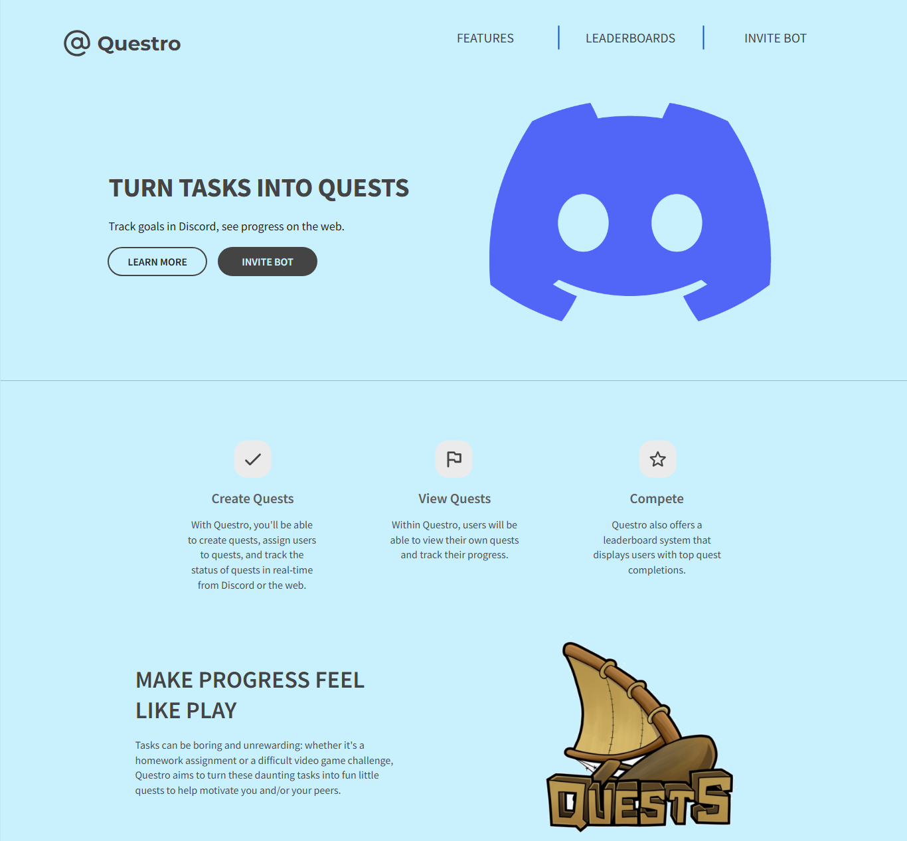
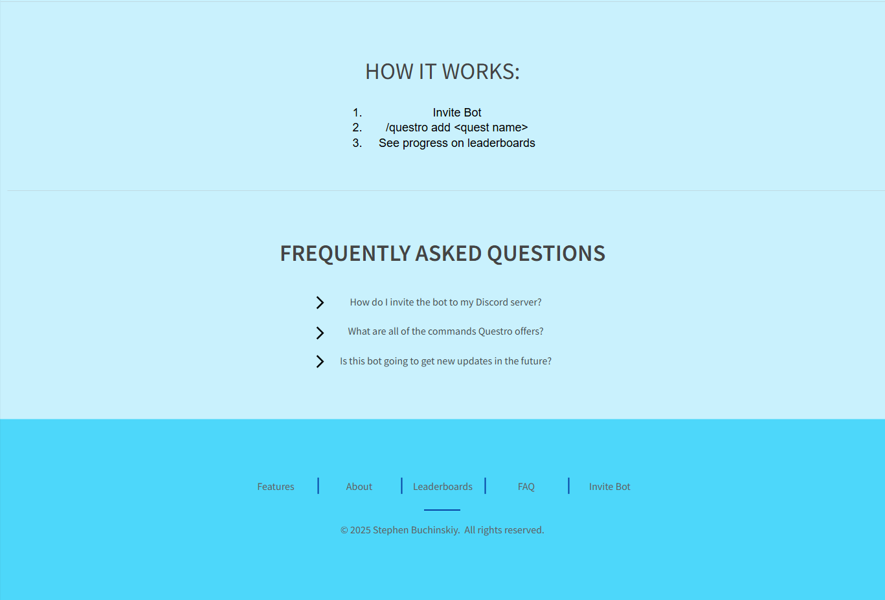

# CS408 Final Project

## Project Spec

The theme that I am choosing for this final project is going to be a quest board implemented with a discord bot and a website frontend. The name of this bot will be "Questro". This quest board would allow users to create and share personal or group quests for users to do. This would be able to be done through Discord using the bot or on the frontend website through a form. It will store all quest data in a AWS database and use CRUD operations to interact with the database. The website will display all quests on a dashboard, showing who created the quest, is assigned to the quest, and the completion status of the quest. People will be able to edit the status of a quest or delete them if necessary, but only through the discord bot until an authentic login system is implemented. People will be able to filter quests by Discord username or by completion status so that all quests in the database aren't shown at all times. The website will also have a leaderboard page to display users with top quest completions, and the discord bot will also have a command to display the leaderboard as a message. The index page of the project will advertise the bot and include instructions on how to add the bot to a discord server. The target audience for this project are friend groups, students, and large servers. This bot will be interesting for friend groups who want a fun quest system to use for daily activities like gaming or other hobbies. It will be interesting for students looking to use Discord for communication and a bot that can keep their projects and studies in check, with a little fun added as a bonus. It can also be used by larger discord servers to set up large server-wide quests for users to complete, with top quest completers being rewarded in some way. The database will manage quest entries with fields like: unique ID for the quest, the quest title, discord ID for who created it, the status of the quest, a timestamp for when the quest was created, and more in the future. The database will also have a score system for users to keep track of how many quests each user completed. There won't be any sensitive data being stored in the database since passwords will be managed by Discord and nothing else like credit cards or phone numbers will be needed. There are also some stretch goals that can be implemented in the future. For example, an XP system that lets users level up based on the number of quests they have done. Quests can also have a set amount of XP that they award based on completion. Another one is categories to allow users to sort and search quests in other ways. Another thing is a login system to allow users to login with their Discord accounts and see quests assigned to them automatically. Lastly, a stats page can be added to show how many quests a server or user has completed in a given timeframe.

## Project Wireframe

https://app.moqups.com/CaLr4AaJmJTRCra8iHRsiBcEnmR7nBql/view/page/a8b49fd9f

Other pages will be implented soon
